# 📚 **DOCUMENTACIÓN EXHAUSTIVA DEL SISTEMA CLÍNICACLICK**

**Fecha de Actualización:** 19 de Julio de 2025  
**Estado:** Sistema de Roles y Permisos Completamente Funcional  
**Versión:** 2.1 - Solución Unificada Implementada

---

## 📋 **ÍNDICE DE CONTENIDOS**

1. [🎯 Resumen Ejecutivo](#resumen)
2. [📊 Estado Actual del Sistema](#estado-actual)
3. [🔐 Sistema de Autenticación](#autenticacion)
4. [👥 Sistema de Roles y Permisos](#roles-permisos)
5. [🗄️ Modelos de Base de Datos](#modelos-bd)
6. [🏥 Sistema de Agrupaciones](#agrupaciones)
7. [🔧 Implementación Técnica](#implementacion)
8. [🚀 Plan de Implementación](#plan-implementacion)
9. [🐛 Troubleshooting](#troubleshooting)
10. [📖 Guías de Uso](#guias-uso)

---

## 🎯 **RESUMEN EJECUTIVO** {#resumen}

### **Propósito del Sistema**

ClinicaClick es una plataforma integral de gestión clínica que permite a diferentes tipos de usuarios (administradores, propietarios, personal médico y pacientes) interactuar con múltiples clínicas según sus roles y permisos específicos.

### **Arquitectura General**

```mermaid
graph TB
    A[Usuario] --> B[Sistema de Autenticación]
    B --> C[Sistema de Roles]
    C --> D[Gestión de Clínicas]
    D --> E[Funcionalidades Específicas]
    
    C --> F[Administrador]
    C --> G[Propietario]
    C --> H[Personal Clínica]
    C --> I[Paciente]
    
    F --> J[Gestión Global]
    G --> K[Gestión Clínica]
    H --> L[Operaciones Médicas]
    I --> M[Servicios Paciente]
```



### **Componentes Principales**

1. **Frontend Angular 19** con Fuse Template
2. **Backend Node.js** con Express y Sequelize
3. **Base de Datos MySQL** con relaciones complejas
4. **Sistema OAuth** para integraciones Meta
5. **Sistema de Roles** multinivel y jerárquico

---

## 📊 **ESTADO ACTUAL DEL SISTEMA (19 JUL 2025)** {#estado-actual}

### ✅ **PROBLEMAS RESUELTOS**

#### **1. Sistema de Roles y Permisos - COMPLETADO**
- ✅ **RoleService unificado** con métodos síncronos para permisos
- ✅ **Directivas *hasRole y *hasPermission** funcionando correctamente
- ✅ **Definición completa de permisos** por rol en `ROL_PERMISSIONS`
- ✅ **Compatibilidad con roles hardcodeados** del backend
- ✅ **Errores de compilación** en ThinLayout corregidos

#### **2. Autenticación JWT - FUNCIONAL**
- ✅ **Clave secreta JWT** sincronizada entre archivos
- ✅ **Decodificación de tokens** funcionando correctamente
- ✅ **Identificación de usuarios** como administrador exitosa
- ✅ **Carga de clínicas** y roles desde backend

#### **3. Directivas Estructurales - OPERATIVAS**
- ✅ **HasRoleDirective** importada y funcionando
- ✅ **HasPermissionDirective** implementada con RoleService
- ✅ **Reactividad automática** cuando cambia el rol
- ✅ **Verificación defensiva** contra errores

### 🔄 **PRÓXIMO PASO IDENTIFICADO**

#### **Problema de Timing en ThinLayout**
**Estado:** Pendiente de implementación  
**Prioridad:** Alta  
**Descripción:** El ThinLayout se renderiza antes de que lleguen los datos del usuario, causando que la interfaz FUSE se vea rota.

**Síntomas:**
- Menú lateral no visible
- Chat abierto por defecto empujando contenido
- Barra superior desplazada
- Layout general desorganizado

**Logs Problemáticos:**
```
👤 [ThinLayout] Usuario cargado: null
🏥 [ThinLayout] Clínicas agrupadas: {}
```

**Solución Propuesta:** Usar `combineLatest` con filtros para esperar a que tanto el usuario como las clínicas estén cargados antes de renderizar la interfaz.

---

## 🔐 **SISTEMA DE AUTENTICACIÓN** {#autenticacion}

### **Flujo de Autenticación**

```mermaid
sequenceDiagram
    participant U as Usuario
    participant F as Frontend
    participant B as Backend
    participant DB as Base de Datos

    U->>F: Credenciales de login
    F->>B: POST /api/auth/sign-in
    B->>DB: Verificar usuario
    DB-->>B: Datos usuario
    B->>B: Generar JWT
    B-->>F: Token + datos usuario
    F->>F: Almacenar token
    F->>B: GET /api/userclinicas/list
    B->>B: Decodificar JWT
    B->>DB: Obtener clínicas del usuario
    DB-->>B: Lista de clínicas con roles
    B-->>F: Clínicas + roles
    F->>F: Establecer rol activo
```



### **Componentes de Autenticación**

#### **AuthService (`src/app/core/auth/auth.service.ts`)**

**Funcionalidades Principales:**
```typescript
@Injectable({ providedIn: 'root' })
export class AuthService {
  private _authenticated: boolean = false;
  private _user: BehaviorSubject<FuseUser | null>;

  // Métodos principales
  signIn(credentials: SignInCredentials): Observable<any>
  signOut(): Observable<any>
  signInUsingToken(): Observable<any>
  getCurrentUser(): Observable<FuseUser | null>
  
  // Métodos de gestión de tokens
  get accessToken(): string
  set accessToken(token: string)
  
  // Métodos adicionales para compatibilidad Fuse
  forgotPassword(email: string): Observable<any>
  resetPassword(email: string, password: string, token?: string): Observable<any>
  signUp(userData: any): Observable<any>
  unlockSession(credentials: { email: string; password: string }): Observable<any>
}
```

**Integración con RoleService:**
```typescript
// En signInUsingToken() - Línea 265 corregida
if (this._roleService && typeof this._roleService.reloadUserData === 'function') {
    this._roleService.reloadUserData();
} else {
    console.warn('⚠️ [AuthService] RoleService.reloadUserData no está disponible');
}
```

#### **Interceptores de Autenticación**

**AuthInterceptor (`src/app/core/auth/auth.interceptor.ts`)**
```typescript
@Injectable()
export class AuthInterceptor implements HttpInterceptor {
  intercept(req: HttpRequest<any>, next: HttpHandler): Observable<HttpEvent<any>> {
    // Agregar token a headers
    if (this.authService.accessToken) {
      req = req.clone({
        setHeaders: {
          Authorization: `Bearer ${this.authService.accessToken}`
        }
      });
    }
    
    return next.handle(req).pipe(
      catchError((error: HttpErrorResponse) => {
        if (error.status === 401) {
          this.authService.signOut();
        }
        return throwError(error);
      })
    );
  }
}
```

### **Gestión de Tokens JWT**

#### **Backend - Generación de Tokens**

**AuthController (`src/controllers/auth.controllers.js`)**
```javascript
// Clave secreta unificada
const secret = '6798261677hH-1';

const signIn = async (req, res) => {
  try {
    const { email, password } = req.body;
    
    // Verificar credenciales
    const user = await Usuario.findOne({ where: { email_usuario: email } });
    if (!user || !bcrypt.compareSync(password, user.password_hash)) {
      return res.status(401).json({ message: 'Credenciales inválidas' });
    }
    
    // Generar token
    const token = jwt.sign(
      { 
        userId: user.id_usuario,
        email: user.email_usuario 
      },
      secret,
      { expiresIn: '24h' }
    );
    
    res.json({
      accessToken: token,
      user: {
        id: user.id_usuario,
        name: user.nombre,
        email: user.email_usuario
      }
    });
  } catch (error) {
    res.status(500).json({ message: 'Error interno del servidor' });
  }
};
```

#### **Backend - Verificación de Tokens**

**UserClinicasRoutes (`src/routes/userclinicas.routes.js`)**
```javascript
// Función para obtener userId del token JWT
const getUserIdFromToken = (token) => {
    try {
        // ✅ CLAVE CORREGIDA: Usar la misma clave secreta que auth.controllers.js
        const decoded = jwt.verify(token, '6798261677hH-1');
        return decoded.userId;
    } catch (error) {
        console.error('❌ Error decodificando JWT:', error);
        return null;
    }
};

// Constante para administradores hardcodeados
const ADMIN_USER_IDS = [1];

// Función para verificar si un usuario es administrador
const isAdmin = (userId) => {
    return ADMIN_USER_IDS.includes(userId);
};
```

### **Manejo de Errores de Autenticación**

#### **Respuestas de Error Comunes**
```javascript
// 401 Unauthorized
{
  "error": "Token expired or invalid",
  "code": "AUTH_FAILED"
}

// 403 Forbidden
{
  "error": "Insufficient permissions",
  "code": "INSUFFICIENT_PERMISSIONS",
  "requiredRole": "administrador"
}
```

#### **Manejo en Frontend**
```typescript
// En interceptores o servicios
catchError((error: HttpErrorResponse) => {
  if (error.status === 401) {
    // Token expirado, forzar logout
    this.authService.signOut();
    this.router.navigate(['/sign-in']);
  } else if (error.status === 403) {
    // Sin permisos, mostrar mensaje
    this.notificationService.show('Sin permisos suficientes');
  }
  
  return throwError(error);
})
```

### **Mejores Prácticas de Seguridad**

#### **Variables de Entorno (Recomendado)**
```bash
# En el archivo .env del backend
JWT_SECRET=tu_clave_super_secreta_y_larga_aqui_2024
JWT_EXPIRES_IN=24h
```

#### **Uso en el código**
```javascript
// En auth.controllers.js
const secret = process.env.JWT_SECRET;

// En userclinicas.routes.js
const decoded = jwt.verify(token, process.env.JWT_SECRET);
```

#### **Ventajas de usar .env**
- ✅ **Seguridad:** La clave no está en el código fuente
- ✅ **Flexibilidad:** Diferentes claves para desarrollo/producción
- ✅ **Mantenimiento:** Un solo lugar para cambiar la clave
- ✅ **Buenas prácticas:** Estándar de la industria

---

## 👥 **SISTEMA DE ROLES Y PERMISOS AVANZADO** {#roles-permisos}

### **Jerarquía de Roles del Sistema**

#### **1. Administrador (Nivel Sistema)**
```typescript
// Características del rol Administrador
{
  nivel: "sistema",
  scope: "global",
  permisos: [
    "sistema.configuracion",
    "usuarios.gestion_completa",
    "clinicas.gestion_completa",
    "roles.asignacion",
    "reportes.sistema",
    "oauth.configuracion"
  ],
  acceso_clinicas: "todas",
  limitaciones: "ninguna"
}
```

**Funcionalidades Exclusivas:**
- Gestión completa de usuarios del sistema
- Configuración de roles y permisos
- Acceso a todas las clínicas sin restricciones
- Configuración de integraciones OAuth
- Reportes globales del sistema
- Gestión de agrupaciones de clínicas

#### **2. Propietario (Nivel Clínica)**
```typescript
// Características del rol Propietario
{
  nivel: "clinica",
  scope: "clinicas_propias",
  permisos: [
    "clinica.configuracion",
    "personal.gestion",
    "pacientes.gestion",
    "servicios.configuracion",
    "reportes.clinica",
    "marketing.gestion"
  ],
  acceso_clinicas: "solo_propias",
  limitaciones: "scope_clinica"
}
```

**Funcionalidades:**
- Gestión completa de su(s) clínica(s)
- Contratación y gestión de personal
- Configuración de servicios médicos
- Gestión de pacientes de su clínica
- Reportes financieros y operativos
- Configuración de marketing y OAuth Meta

#### **3. Personal de Clínica (Nivel Operativo)**
```typescript
// Características del Personal de Clínica
{
  nivel: "operativo",
  scope: "clinicas_asignadas",
  subroles: {
    "Doctores": {
      permisos: [
        "pacientes.consulta",
        "historiales.edicion",
        "citas.gestion",
        "tratamientos.prescripcion"
      ]
    },
    "Auxiliares y enfermeros": {
      permisos: [
        "pacientes.atencion",
        "citas.confirmacion",
        "historiales.lectura",
        "procedimientos.asistencia"
      ]
    },
    "Administrativos": {
      permisos: [
        "citas.programacion",
        "facturacion.gestion",
        "reportes.operativos",
        "comunicacion.pacientes"
      ]
    }
  },
  acceso_clinicas: "solo_asignadas",
  limitaciones: "subrol_especifico"
}
```

#### **4. Paciente (Nivel Usuario)**
```typescript
// Características del rol Paciente
{
  nivel: "usuario",
  scope: "datos_propios",
  permisos: [
    "perfil.edicion",
    "citas.solicitud",
    "historial.consulta",
    "facturas.consulta",
    "comunicacion.clinica"
  ],
  acceso_clinicas: "solo_como_paciente",
  limitaciones: "datos_personales_unicamente"
}
```

### **Implementación en Frontend - Solución Unificada**

#### **RoleService Actualizado (`src/app/core/services/role.service.ts`)**

**Estructura Principal:**
```typescript
@Injectable({
  providedIn: 'root'
})
export class RoleService {
  // Subjects para estado reactivo
  private currentUserSubject = new BehaviorSubject<Usuario | null>(null);
  private selectedRoleSubject = new BehaviorSubject<string | null>(null);
  private selectedClinicaSubject = new BehaviorSubject<any | null>(null);
  private clinicasSubject = new BehaviorSubject<any[]>([]);

  // Observables públicos
  public currentUser$ = this.currentUserSubject.asObservable();
  public selectedRole$ = this.selectedRoleSubject.asObservable();
  public selectedClinica$ = this.selectedClinicaSubject.asObservable();
  public clinicas$ = this.clinicasSubject.asObservable();

  constructor(private http: HttpClient) {
    this.loadUserFromToken();
  }
}
```

**Sistema de Permisos Unificado:**
```typescript
// Definición completa de permisos por rol
private readonly ROL_PERMISSIONS: Record<string, string[]> = {
    'administrador': [
        'clinics.manage',
        'patients.view',
        'users.manage',
        'reports.view',
        'settings.manage',
        'system.configure',
        'roles.assign',
        'oauth.configure'
    ],
    'propietario': [
        'clinics.manage',
        'patients.view',
        'users.manage',
        'reports.view',
        'staff.hire',
        'services.configure',
        'marketing.manage',
        'oauth.connect'
    ],
    'personaldeclinica': [
        'patients.view',
        'appointments.manage',
        'reports.view',
        'patients.attend',
        'histories.access'
    ],
    'paciente': [
        'profile.view',
        'appointments.view',
        'appointments.request',
        'history.view',
        'bills.view'
    ]
};

// Métodos de verificación de permisos (síncronos)
hasPermission(permission: string): boolean {
    const currentRole = this.getCurrentRole();
    if (!currentRole) return false;

    const rolePermissions = this.ROL_PERMISSIONS[currentRole] || [];
    return rolePermissions.includes(permission);
}

hasAnyPermission(permissions: string[]): boolean {
    return permissions.some(permission => this.hasPermission(permission));
}

hasAllPermissions(permissions: string[]): boolean {
    return permissions.every(permission => this.hasPermission(permission));
}
```

**Métodos de Verificación de Roles:**
```typescript
// Verificar si el usuario tiene un rol específico
hasRole(role: string): boolean {
  const currentRole = this.getCurrentRole();
  if (!currentRole) return false;

  // Mapear roles legacy para compatibilidad
  const mappedCurrentRole = this.mapRole(currentRole);
  const mappedTargetRole = this.mapRole(role);

  return mappedCurrentRole === mappedTargetRole;
}

// Verificar múltiples roles (OR logic)
hasAnyRole(roles: string[]): boolean {
  return roles.some(role => this.hasRole(role));
}

// Verificar todos los roles (AND logic)
hasAllRoles(roles: string[]): boolean {
  return roles.every(role => this.hasRole(role));
}

// Mapeo de roles legacy
private mapRole(role: string): string {
  const roleMapping: Record<string, string> = {
    'admin': 'administrador',
    'owner': 'propietario',
    'staff': 'personaldeclinica',
    'patient': 'paciente'
  };
  
  return roleMapping[role] || role;
}
```

**Gestión de Clínicas por Rol:**
```typescript
// Obtener clínicas disponibles según el rol actual
getAvailableRoles(): string[] {
  const clinicas = this.clinicasSubject.value;
  return clinicas.map(clinica => clinica.userRole).filter((role, index, self) => self.indexOf(role) === index);
}

// Filtrar clínicas por rol específico
getClinicsByRole(role: string): any[] {
  const clinicas = this.clinicasSubject.value;
  return clinicas.filter(clinica => clinica.userRole === role);
}

// Agrupar clínicas por rol
groupClinicsByRole(): Record<string, any[]> {
  const clinicas = this.clinicasSubject.value;
  const grouped: Record<string, any[]> = {};

  clinicas.forEach(clinica => {
    const role = clinica.userRole;
    if (!grouped[role]) {
      grouped[role] = [];
    }
    grouped[role].push(clinica);
  });

  return grouped;
}
```

### **Directivas Estructurales Actualizadas**

#### **HasRoleDirective (`src/app/modules/admin/apps/roles/shared/has-role.directive.ts`)**

**Implementación Completa:**
```typescript
@Directive({
  selector: '[hasRole]',
  standalone: true
})
export class HasRoleDirective implements OnInit, OnDestroy {
  @Input() hasRole!: UserRole | UserRole[];

  private destroy$ = new Subject<void>();

  constructor(
    private templateRef: TemplateRef<any>,
    private viewContainer: ViewContainerRef,
    private roleService: RoleService
  ) {}

  ngOnInit(): void {
    this.checkRoles(this.hasRole);
    
    // Reaccionar a cambios de rol
    this.roleService.selectedRole$.pipe(
      takeUntil(this.destroy$)
    ).subscribe(() => {
      this.checkRoles(this.hasRole);
    });
  }

  private checkRoles(roles: UserRole | UserRole[]): void {
    try {
      let hasRole = false;

      if (typeof roles === 'string') {
        // Rol único
        hasRole = this.roleService.hasRole(roles);
      } else if (Array.isArray(roles)) {
        // Múltiples roles (OR logic)
        hasRole = this.roleService.hasAnyRole(roles);
      }

      this.updateView(hasRole);
    } catch (error) {
      console.error('[HasRoleDirective] Error checking roles:', error);
      this.updateView(false);
    }
  }

  private updateView(hasRole: boolean): void {
    if (hasRole) {
      this.showElement();
    } else {
      this.hideElement();
    }
  }

  private showElement(): void {
    if (this.viewContainer.length === 0) {
      this.viewContainer.createEmbeddedView(this.templateRef);
    }
  }

  private hideElement(): void {
    this.viewContainer.clear();
  }

  ngOnDestroy(): void {
    this.destroy$.next();
    this.destroy$.complete();
  }
}
```

#### **HasPermissionDirective Unificada (`src/app/modules/admin/apps/roles/shared/has-permission.directive.ts`)**

**Implementación Simplificada:**
```typescript
@Directive({
  selector: '[hasPermission]',
  standalone: true
})
export class HasPermissionDirective implements OnInit, OnDestroy {
  @Input() hasPermission!: string | string[];

  private destroy$ = new Subject<void>();

  constructor(
    private templateRef: TemplateRef<any>,
    private viewContainer: ViewContainerRef,
    private roleService: RoleService  // ✅ Usa RoleService directamente
  ) {}

  ngOnInit(): void {
    this.checkPermission();
    
    // Reaccionar a cambios de rol
    this.roleService.selectedRole$.pipe(
      takeUntil(this.destroy$)
    ).subscribe(() => {
      this.checkPermission();
    });
  }

  private checkPermission(): void {
    try {
      let hasPermission = false;

      if (typeof this.hasPermission === 'string') {
        // Permiso único
        hasPermission = this.roleService.hasPermission(this.hasPermission);
      } else if (Array.isArray(this.hasPermission)) {
        // Múltiples permisos (OR logic)
        hasPermission = this.roleService.hasAnyPermission(this.hasPermission);
      }

      this.updateView(hasPermission);
    } catch (error) {
      console.error('[HasPermissionDirective] Error checking permissions:', error);
      this.updateView(false);
    }
  }

  private updateView(hasPermission: boolean): void {
    if (hasPermission) {
      this.showElement();
    } else {
      this.hideElement();
    }
  }

  private showElement(): void {
    if (this.viewContainer.length === 0) {
      this.viewContainer.createEmbeddedView(this.templateRef);
    }
  }

  private hideElement(): void {
    this.viewContainer.clear();
  }

  ngOnDestroy(): void {
    this.destroy$.next();
    this.destroy$.complete();
  }
}
```

**Uso en Templates:**
```html
<!-- Rol único -->
<div *hasRole="'administrador'">
  Solo visible para administradores
</div>

<!-- Múltiples roles -->
<div *hasRole="['propietario', 'administrador']">
  Visible para propietarios o administradores
</div>

<!-- Permiso específico -->
<button *hasPermission="'clinics.manage'">
  Gestionar Clínicas
</button>

<!-- Múltiples permisos -->
<mat-tab *hasPermission="['reports.view', 'system.configure']">
  Reportes del Sistema
</mat-tab>
```

### **Componente de Prueba Actualizado**

#### **RoleTestComponent (`src/app/modules/admin/apps/roles/components/role-test-component.ts`)**

**Implementación Completa:**
```typescript
@Component({
    selector: 'app-role-test',
    templateUrl: './role-test-component.html',
    imports: [
        CommonModule,
        MatButtonModule,
        MatCardModule,
        MatIconModule,
        HasRoleDirective,      // ✅ AGREGADO
        HasPermissionDirective // ✅ AGREGADO
    ],
    standalone: true
})
export class RoleTestComponent implements OnInit {
    currentRole: string | null = null;
    currentUser: any = null;
    availableRoles: string[] = [];

    constructor(private roleService: RoleService) {}

    ngOnInit(): void {
        // Suscribirse a cambios de rol
        this.roleService.selectedRole$.subscribe(role => {
            this.currentRole = role;
            console.log('🎭 [RoleTest] Rol actual:', role);
        });

        // Suscribirse a cambios de usuario
        this.roleService.currentUser$.subscribe(user => {
            this.currentUser = user;
            console.log('👤 [RoleTest] Usuario actual:', user);
        });

        // Obtener roles disponibles
        this.availableRoles = this.roleService.getAvailableRoles();
        console.log('📋 [RoleTest] Roles disponibles:', this.availableRoles);
    }

    // Métodos de debug
    debugRoles(): void {
        console.log('🔍 [DEBUG] Rol actual del usuario:', this.roleService.getCurrentRole());
        console.log('🔍 [DEBUG] ¿Tiene rol admin?', this.roleService.hasRole('admin'));
        console.log('🔍 [DEBUG] ¿Tiene rol administrador?', this.roleService.hasRole('administrador'));
        console.log('🔍 [DEBUG] ¿Tiene rol propietario?', this.roleService.hasRole('propietario'));
    }

    debugPermissions(): void {
        console.log('🔑 [DEBUG] ¿Puede gestionar clínicas?', this.roleService.hasPermission('clinics.manage'));
        console.log('🔑 [DEBUG] ¿Puede ver pacientes?', this.roleService.hasPermission('patients.view'));
        console.log('🔑 [DEBUG] ¿Puede gestionar usuarios?', this.roleService.hasPermission('users.manage'));
    }

    testMultiplePermissions(): void {
        const permissions = ['clinics.manage', 'patients.view'];
        console.log('🔑 [DEBUG] ¿Tiene alguno de estos permisos?', this.roleService.hasAnyPermission(permissions));
        console.log('🔑 [DEBUG] ¿Tiene todos estos permisos?', this.roleService.hasAllPermissions(permissions));
    }
}
```

### **Constantes de Roles Actualizadas**

#### **RoleConstants (`src/app/core/constants/role.constants.ts`)**

**Definiciones Completas:**
```typescript
// Tipos de roles
export type RolClinica = 'paciente' | 'personaldeclinica' | 'propietario';
export type UserRole = RolClinica | 'administrador' | string | string[];

// Roles del sistema
export const ROLES = {
  ADMINISTRADOR: 'administrador',
  PROPIETARIO: 'propietario',
  PERSONAL_CLINICA: 'personaldeclinica',
  PACIENTE: 'paciente'
} as const;

// Subroles del personal
export const SUBROLES = {
  DOCTORES: 'Doctores',
  AUXILIARES: 'Auxiliares y enfermeros',
  ADMINISTRATIVOS: 'Administrativos'
} as const;

// Mapeo de roles legacy
export const ROLE_MAPPING: Record<string, string> = {
  'admin': 'administrador',
  'owner': 'propietario',
  'staff': 'personaldeclinica',
  'patient': 'paciente'
};

// Jerarquía de roles (mayor número = mayor privilegio)
export const ROLE_HIERARCHY: Record<string, number> = {
  'paciente': 1,
  'personaldeclinica': 2,
  'propietario': 3,
  'administrador': 4
};

// Permisos por rol (centralizado)
export const ROL_PERMISSIONS: Record<string, string[]> = {
    'administrador': [
        'clinics.manage',
        'patients.view',
        'users.manage',
        'reports.view',
        'settings.manage',
        'system.configure',
        'roles.assign',
        'oauth.configure'
    ],
    'propietario': [
        'clinics.manage',
        'patients.view',
        'users.manage',
        'reports.view',
        'staff.hire',
        'services.configure',
        'marketing.manage',
        'oauth.connect'
    ],
    'personaldeclinica': [
        'patients.view',
        'appointments.manage',
        'reports.view',
        'patients.attend',
        'histories.access'
    ],
    'paciente': [
        'profile.view',
        'appointments.view',
        'appointments.request',
        'history.view',
        'bills.view'
    ]
};

// Funciones helper
export const mapRole = (role: string): string => {
  return ROLE_MAPPING[role] || role;
};

export const isAdminRole = (role: string): boolean => {
  return role === ROLES.ADMINISTRADOR;
};

export const isMedicalRole = (role: string, subrol?: string): boolean => {
  return role === ROLES.PERSONAL_CLINICA && 
         (subrol === SUBROLES.DOCTORES || subrol === SUBROLES.AUXILIARES);
};

export const getRoleHierarchy = (role: string): number => {
  return ROLE_HIERARCHY[role] || 0;
};

export const canManageRole = (managerRole: string, targetRole: string): boolean => {
  return getRoleHierarchy(managerRole) > getRoleHierarchy(targetRole);
};
```

### **Estado Actual del Rol Administrador**

#### **Implementación Backend**

**Problema Temporal:**
```javascript
// Backend actual (userclinicas.routes.js)
const ADMIN_USER_IDS = [1]; // Hardcodeado
const isAdmin = (userId) => {
    return ADMIN_USER_IDS.includes(userId);
};

// Si es admin, devuelve:
userRole: 'administrador', // ← Generado dinámicamente
userType: 'administrador'
```

**Logs Actuales Exitosos:**
```javascript
🎭 Rol seleccionado: administrador
🔍 [DEBUG] ¿Tiene rol administrador? true  // ✅ Funciona
🔑 [DEBUG] ¿Puede gestionar clínicas? true // ✅ Funciona
```

**Solución Definitiva Recomendada:**
1. Agregar `'administrador'` al ENUM de `rol_clinica` en BD
2. Migrar usuarios hardcodeados a registros en `usuario_clinicas`
3. Eliminar lógica hardcodeada del backend
4. Implementar gestión de administradores desde frontend

---

## 🗄️ **MODELOS DE BASE DE DATOS COMPLETOS** {#modelos-bd}

### **Diagrama de Relaciones**


### **Modelo Usuario**

#### **Tabla: `usuarios`**
```sql
CREATE TABLE usuarios (
    id_usuario INT AUTO_INCREMENT PRIMARY KEY,
    nombre VARCHAR(100) NOT NULL,
    apellidos VARCHAR(100) NOT NULL,
    email_usuario VARCHAR(255) UNIQUE NOT NULL,
    email_factura VARCHAR(255),
    password_hash VARCHAR(255) NOT NULL,
    telefono VARCHAR(20),
    direccion TEXT,
    fecha_nacimiento DATE,
    activo BOOLEAN DEFAULT TRUE,
    fecha_creacion TIMESTAMP DEFAULT CURRENT_TIMESTAMP,
    fecha_actualizacion TIMESTAMP DEFAULT CURRENT_TIMESTAMP ON UPDATE CURRENT_TIMESTAMP,
    
    INDEX idx_email (email_usuario),
    INDEX idx_activo (activo)
);
```

#### **Modelo Sequelize: `src/models/usuario.js`**
```javascript
const Usuario = sequelize.define('Usuario', {
  id_usuario: {
    type: DataTypes.INTEGER,
    primaryKey: true,
    autoIncrement: true
  },
  nombre: {
    type: DataTypes.STRING(100),
    allowNull: false,
    validate: {
      notEmpty: true,
      len: [2, 100]
    }
  },
  apellidos: {
    type: DataTypes.STRING(100),
    allowNull: false,
    validate: {
      notEmpty: true,
      len: [2, 100]
    }
  },
  email_usuario: {
    type: DataTypes.STRING(255),
    allowNull: false,
    unique: true,
    validate: {
      isEmail: true
    }
  },
  email_factura: {
    type: DataTypes.STRING(255),
    validate: {
      isEmail: true
    }
  },
  password_hash: {
    type: DataTypes.STRING(255),
    allowNull: false
  },
  telefono: {
    type: DataTypes.STRING(20),
    validate: {
      is: /^[+]?[\d\s\-()]+$/
    }
  },
  direccion: {
    type: DataTypes.TEXT
  },
  fecha_nacimiento: {
    type: DataTypes.DATEONLY,
    validate: {
      isDate: true,
      isBefore: new Date().toISOString()
    }
  },
  activo: {
    type: DataTypes.BOOLEAN,
    defaultValue: true
  }
}, {
  tableName: 'usuarios',
  timestamps: true,
  createdAt: 'fecha_creacion',
  updatedAt: 'fecha_actualizacion'
});
```

### **Modelo Clínica**

#### **Tabla: `clinicas`**
```sql
CREATE TABLE clinicas (
    id_clinica INT AUTO_INCREMENT PRIMARY KEY,
    nombre_clinica VARCHAR(200) NOT NULL,
    descripcion TEXT,
    direccion TEXT,
    telefono VARCHAR(20),
    email VARCHAR(255),
    url_web VARCHAR(500),
    url_avatar VARCHAR(500),
    ciudad VARCHAR(100),
    id_grupo_clinica INT,
    activo BOOLEAN DEFAULT TRUE,
    fecha_creacion TIMESTAMP DEFAULT CURRENT_TIMESTAMP,
    fecha_actualizacion TIMESTAMP DEFAULT CURRENT_TIMESTAMP ON UPDATE CURRENT_TIMESTAMP,
    
    FOREIGN KEY (id_grupo_clinica) REFERENCES grupo_clinicas(id_grupo_clinica),
    INDEX idx_grupo (id_grupo_clinica),
    INDEX idx_ciudad (ciudad),
    INDEX idx_activo (activo)
);
```

#### **Modelo Sequelize: `src/models/clinica.js`**
```javascript
const Clinica = sequelize.define('Clinica', {
  id_clinica: {
    type: DataTypes.INTEGER,
    primaryKey: true,
    autoIncrement: true
  },
  nombre_clinica: {
    type: DataTypes.STRING(200),
    allowNull: false,
    validate: {
      notEmpty: true,
      len: [3, 200]
    }
  },
  descripcion: {
    type: DataTypes.TEXT
  },
  direccion: {
    type: DataTypes.TEXT
  },
  telefono: {
    type: DataTypes.STRING(20),
    validate: {
      is: /^[+]?[\d\s\-()]+$/
    }
  },
  email: {
    type: DataTypes.STRING(255),
    validate: {
      isEmail: true
    }
  },
  url_web: {
    type: DataTypes.STRING(500),
    validate: {
      isUrl: true
    }
  },
  url_avatar: {
    type: DataTypes.STRING(500),
    validate: {
      isUrl: true
    }
  },
  ciudad: {
    type: DataTypes.STRING(100)
  },
  id_grupo_clinica: {
    type: DataTypes.INTEGER,
    references: {
      model: 'grupo_clinicas',
      key: 'id_grupo_clinica'
    }
  },
  activo: {
    type: DataTypes.BOOLEAN,
    defaultValue: true
  }
}, {
  tableName: 'clinicas',
  timestamps: true,
  createdAt: 'fecha_creacion',
  updatedAt: 'fecha_actualizacion'
});
```

### **Modelo Usuario-Clínica (Relación N:M con Roles)**

#### **Tabla: `usuario_clinicas`**
```sql
CREATE TABLE usuario_clinicas (
    id_usuario INT NOT NULL,
    id_clinica INT NOT NULL,
    rol_clinica ENUM('paciente', 'personaldeclinica', 'propietario', 'administrador') NOT NULL,
    subrol_clinica ENUM('Auxiliares y enfermeros', 'Doctores', 'Administrativos') NULL,
    fecha_asignacion DATE DEFAULT (CURRENT_DATE),
    activo BOOLEAN DEFAULT TRUE,
    fecha_creacion TIMESTAMP DEFAULT CURRENT_TIMESTAMP,
    
    PRIMARY KEY (id_usuario, id_clinica, rol_clinica),
    FOREIGN KEY (id_usuario) REFERENCES usuarios(id_usuario) ON DELETE CASCADE,
    FOREIGN KEY (id_clinica) REFERENCES clinicas(id_clinica) ON DELETE CASCADE,
    
    INDEX idx_usuario (id_usuario),
    INDEX idx_clinica (id_clinica),
    INDEX idx_rol (rol_clinica),
    INDEX idx_activo (activo)
);
```

#### **Modelo Sequelize: `src/models/usuarioclinica.js`**
```javascript
const UsuarioClinica = sequelize.define('UsuarioClinica', {
  id_usuario: {
    type: DataTypes.INTEGER,
    primaryKey: true,
    references: {
      model: 'usuarios',
      key: 'id_usuario'
    }
  },
  id_clinica: {
    type: DataTypes.INTEGER,
    primaryKey: true,
    references: {
      model: 'clinicas',
      key: 'id_clinica'
    }
  },
  rol_clinica: {
    type: DataTypes.ENUM('paciente', 'personaldeclinica', 'propietario', 'administrador'),
    primaryKey: true,
    allowNull: false,
    validate: {
      isIn: [['paciente', 'personaldeclinica', 'propietario', 'administrador']]
    }
  },
  subrol_clinica: {
    type: DataTypes.ENUM('Auxiliares y enfermeros', 'Doctores', 'Administrativos'),
    allowNull: true,
    validate: {
      // Solo personal de clínica puede tener subrol
      customValidator(value) {
        if (value && this.rol_clinica !== 'personaldeclinica') {
          throw new Error('Solo el personal de clínica puede tener subrol');
        }
      }
    }
  },
  fecha_asignacion: {
    type: DataTypes.DATEONLY,
    defaultValue: DataTypes.NOW
  },
  activo: {
    type: DataTypes.BOOLEAN,
    defaultValue: true
  }
}, {
  tableName: 'usuario_clinicas',
  timestamps: true,
  createdAt: 'fecha_creacion',
  updatedAt: false
});
```

### **Modelo Grupo de Clínicas**

#### **Tabla: `grupo_clinicas`**
```sql
CREATE TABLE grupo_clinicas (
    id_grupo_clinica INT AUTO_INCREMENT PRIMARY KEY,
    nombre_grupo VARCHAR(200) NOT NULL,
    descripcion TEXT,
    fecha_creacion TIMESTAMP DEFAULT CURRENT_TIMESTAMP,
    fecha_actualizacion TIMESTAMP DEFAULT CURRENT_TIMESTAMP ON UPDATE CURRENT_TIMESTAMP,
    
    INDEX idx_nombre (nombre_grupo)
);
```

#### **Modelo Sequelize: `src/models/grupoclinica.js`**
```javascript
const GrupoClinica = sequelize.define('GrupoClinica', {
  id_grupo_clinica: {
    type: DataTypes.INTEGER,
    primaryKey: true,
    autoIncrement: true
  },
  nombre_grupo: {
    type: DataTypes.STRING(200),
    allowNull: false,
    unique: true,
    validate: {
      notEmpty: true,
      len: [3, 200]
    }
  },
  descripcion: {
    type: DataTypes.TEXT
  }
}, {
  tableName: 'grupo_clinicas',
  timestamps: true,
  createdAt: 'fecha_creacion',
  updatedAt: 'fecha_actualizacion'
});
```

### **Modelos OAuth Meta**

#### **Tabla: `meta_connections`**
```sql
CREATE TABLE meta_connections (
    id INT AUTO_INCREMENT PRIMARY KEY,
    id_usuario INT NOT NULL,
    access_token TEXT NOT NULL,
    refresh_token TEXT,
    expires_at DATETIME NOT NULL,
    account_id VARCHAR(100) NOT NULL,
    account_name VARCHAR(255),
    scope TEXT,
    token_type VARCHAR(50) DEFAULT 'Bearer',
    fecha_creacion TIMESTAMP DEFAULT CURRENT_TIMESTAMP,
    fecha_actualizacion TIMESTAMP DEFAULT CURRENT_TIMESTAMP ON UPDATE CURRENT_TIMESTAMP,
    
    FOREIGN KEY (id_usuario) REFERENCES usuarios(id_usuario) ON DELETE CASCADE,
    UNIQUE KEY unique_user_account (id_usuario, account_id),
    INDEX idx_usuario (id_usuario),
    INDEX idx_expires (expires_at)
);
```

#### **Modelo Sequelize: `src/models/metaconnection.js`**
```javascript
const MetaConnection = sequelize.define('MetaConnection', {
  id: {
    type: DataTypes.INTEGER,
    primaryKey: true,
    autoIncrement: true
  },
  id_usuario: {
    type: DataTypes.INTEGER,
    allowNull: false,
    references: {
      model: 'usuarios',
      key: 'id_usuario'
    }
  },
  access_token: {
    type: DataTypes.TEXT,
    allowNull: false
  },
  refresh_token: {
    type: DataTypes.TEXT
  },
  expires_at: {
    type: DataTypes.DATE,
    allowNull: false,
    validate: {
      isDate: true,
      isAfter: new Date().toISOString()
    }
  },
  account_id: {
    type: DataTypes.STRING(100),
    allowNull: false
  },
  account_name: {
    type: DataTypes.STRING(255)
  },
  scope: {
    type: DataTypes.TEXT
  },
  token_type: {
    type: DataTypes.STRING(50),
    defaultValue: 'Bearer'
  }
}, {
  tableName: 'meta_connections',
  timestamps: true,
  createdAt: 'fecha_creacion',
  updatedAt: 'fecha_actualizacion',
  indexes: [
    {
      unique: true,
      fields: ['id_usuario', 'account_id']
    }
  ]
});
```

#### **Tabla: `clinic_meta_assets`**
```sql
CREATE TABLE clinic_meta_assets (
    id INT AUTO_INCREMENT PRIMARY KEY,
    id_clinica INT NOT NULL,
    id_meta_connection INT NOT NULL,
    asset_id VARCHAR(100) NOT NULL,
    asset_name VARCHAR(255) NOT NULL,
    asset_type ENUM('page', 'ad_account', 'pixel', 'instagram_account') NOT NULL,
    asset_data JSON,
    activo BOOLEAN DEFAULT TRUE,
    fecha_creacion TIMESTAMP DEFAULT CURRENT_TIMESTAMP,
    fecha_actualizacion TIMESTAMP DEFAULT CURRENT_TIMESTAMP ON UPDATE CURRENT_TIMESTAMP,
    
    FOREIGN KEY (id_clinica) REFERENCES clinicas(id_clinica) ON DELETE CASCADE,
    FOREIGN KEY (id_meta_connection) REFERENCES meta_connections(id) ON DELETE CASCADE,
    UNIQUE KEY unique_clinic_asset (id_clinica, asset_id, asset_type),
    INDEX idx_clinica (id_clinica),
    INDEX idx_connection (id_meta_connection),
    INDEX idx_type (asset_type)
);
```

#### **Modelo Sequelize: `src/models/clinicmetaasset.js`**
```javascript
const ClinicMetaAsset = sequelize.define('ClinicMetaAsset', {
  id: {
    type: DataTypes.INTEGER,
    primaryKey: true,
    autoIncrement: true
  },
  id_clinica: {
    type: DataTypes.INTEGER,
    allowNull: false,
    references: {
      model: 'clinicas',
      key: 'id_clinica'
    }
  },
  id_meta_connection: {
    type: DataTypes.INTEGER,
    allowNull: false,
    references: {
      model: 'meta_connections',
      key: 'id'
    }
  },
  asset_id: {
    type: DataTypes.STRING(100),
    allowNull: false
  },
  asset_name: {
    type: DataTypes.STRING(255),
    allowNull: false
  },
  asset_type: {
    type: DataTypes.ENUM('page', 'ad_account', 'pixel', 'instagram_account'),
    allowNull: false
  },
  asset_data: {
    type: DataTypes.JSON,
    defaultValue: {}
  },
  activo: {
    type: DataTypes.BOOLEAN,
    defaultValue: true
  }
}, {
  tableName: 'clinic_meta_assets',
  timestamps: true,
  createdAt: 'fecha_creacion',
  updatedAt: 'fecha_actualizacion',
  indexes: [
    {
      unique: true,
      fields: ['id_clinica', 'asset_id', 'asset_type']
    }
  ]
});
```

### **Relaciones entre Modelos**

#### **Definición de Asociaciones**
```javascript
// En src/models/index.js

// Usuario - UsuarioClinica (1:N)
Usuario.hasMany(UsuarioClinica, {
  foreignKey: 'id_usuario',
  as: 'clinicas'
});
UsuarioClinica.belongsTo(Usuario, {
  foreignKey: 'id_usuario',
  as: 'usuario'
});

// Clinica - UsuarioClinica (1:N)
Clinica.hasMany(UsuarioClinica, {
  foreignKey: 'id_clinica',
  as: 'usuarios'
});
UsuarioClinica.belongsTo(Clinica, {
  foreignKey: 'id_clinica',
  as: 'clinica'
});

// GrupoClinica - Clinica (1:N)
GrupoClinica.hasMany(Clinica, {
  foreignKey: 'id_grupo_clinica',
  as: 'clinicas'
});
Clinica.belongsTo(GrupoClinica, {
  foreignKey: 'id_grupo_clinica',
  as: 'grupo'
});

// Usuario - MetaConnection (1:N)
Usuario.hasMany(MetaConnection, {
  foreignKey: 'id_usuario',
  as: 'metaConnections'
});
MetaConnection.belongsTo(Usuario, {
  foreignKey: 'id_usuario',
  as: 'usuario'
});

// Clinica - ClinicMetaAsset (1:N)
Clinica.hasMany(ClinicMetaAsset, {
  foreignKey: 'id_clinica',
  as: 'metaAssets'
});
ClinicMetaAsset.belongsTo(Clinica, {
  foreignKey: 'id_clinica',
  as: 'clinica'
});

// MetaConnection - ClinicMetaAsset (1:N)
MetaConnection.hasMany(ClinicMetaAsset, {
  foreignKey: 'id_meta_connection',
  as: 'assets'
});
ClinicMetaAsset.belongsTo(MetaConnection, {
  foreignKey: 'id_meta_connection',
  as: 'connection'
});
```

### **Consultas Comunes**

#### **Obtener Usuario con Roles y Clínicas**
```javascript
// Backend: src/controllers/user.controller.js
const getUserWithRoles = async (userId) => {
  return await Usuario.findByPk(userId, {
    include: [
      {
        model: UsuarioClinica,
        as: 'clinicas',
        where: { activo: true },
        include: [
          {
            model: Clinica,
            as: 'clinica',
            include: [
              {
                model: GrupoClinica,
                as: 'grupo'
              }
            ]
          }
        ]
      },
      {
        model: MetaConnection,
        as: 'metaConnections',
        where: { expires_at: { [Op.gt]: new Date() } },
        required: false
      }
    ]
  });
};
```

#### **Obtener Clínicas por Rol**
```javascript
const getClinicasByRole = async (userId, role) => {
  return await Clinica.findAll({
    include: [
      {
        model: UsuarioClinica,
        as: 'usuarios',
        where: {
          id_usuario: userId,
          rol_clinica: role,
          activo: true
        }
      },
      {
        model: GrupoClinica,
        as: 'grupo'
      }
    ]
  });
};
```

#### **Verificar Permisos en Clínica**
```javascript
const hasRoleInClinica = async (userId, clinicaId, requiredRole) => {
  const userClinica = await UsuarioClinica.findOne({
    where: {
      id_usuario: userId,
      id_clinica: clinicaId,
      rol_clinica: requiredRole,
      activo: true
    }
  });
  
  return !!userClinica;
};
```

---

## 🏥 **SISTEMA DE AGRUPACIONES DE CLÍNICAS** {#agrupaciones}

### **Concepto y Propósito**

Las **Agrupaciones de Clínicas** son entidades organizacionales que permiten agrupar múltiples clínicas bajo una misma administración o marca. Este sistema está diseñado para:

- **Cadenas de clínicas**: Empresas con múltiples establecimientos
- **Franquicias médicas**: Redes de clínicas independientes bajo una marca
- **Grupos empresariales**: Holding que gestiona varias clínicas
- **Filtrado eficiente**: Visualización organizada por grupos

### **Arquitectura del Sistema**

#### **Modelo de Datos**


#### **Casos de Uso Principales**

**1. Cadena de Clínicas Dentales**
```javascript
// Ejemplo: "Sonrisas Perfectas"
{
  id_grupo_clinica: 1,
  nombre_grupo: "Sonrisas Perfectas",
  descripcion: "Cadena de clínicas dentales especializadas",
  clinicas: [
    { nombre_clinica: "Sonrisas Perfectas - Centro", ciudad: "Madrid" },
    { nombre_clinica: "Sonrisas Perfectas - Norte", ciudad: "Madrid" },
    { nombre_clinica: "Sonrisas Perfectas - Sur", ciudad: "Madrid" }
  ]
}
```

**2. Franquicia Médica**
```javascript
// Ejemplo: "MediCare Plus"
{
  id_grupo_clinica: 2,
  nombre_grupo: "MediCare Plus",
  descripcion: "Red de franquicias de medicina general",
  clinicas: [
    { nombre_clinica: "MediCare Plus - Barcelona", propietario: "Dr. García" },
    { nombre_clinica: "MediCare Plus - Valencia", propietario: "Dra. López" },
    { nombre_clinica: "MediCare Plus - Sevilla", propietario: "Dr. Martín" }
  ]
}
```

### **Implementación en Frontend**

#### **Visualización por Grupos**

```typescript
// En RoleService
groupClinicsByGroup(): Record<string, any[]> {
  const clinicas = this.clinicasSubject.value;
  const grouped: Record<string, any[]> = {};

  clinicas.forEach(clinica => {
    const groupName = clinica.grupo?.nombre_grupo || 'Sin Grupo';
    if (!grouped[groupName]) {
      grouped[groupName] = [];
    }
    grouped[groupName].push(clinica);
  });

  return grouped;
}
```

#### **Componente de Selección de Clínicas**

```html
<!-- clinic-selector.component.html -->
<div class="clinic-groups">
  <div *ngFor="let group of clinicGroups | keyvalue" class="group-section">
    <h3 class="group-title">{{ group.key }}</h3>
    
    <div class="clinics-grid">
      <mat-card 
        *ngFor="let clinica of group.value" 
        class="clinic-card"
        [class.selected]="isSelected(clinica)"
        (click)="selectClinica(clinica)">
        
        <mat-card-header>
          <mat-card-title>{{ clinica.nombre_clinica }}</mat-card-title>
          <mat-card-subtitle>{{ clinica.ciudad }}</mat-card-subtitle>
        </mat-card-header>
        
        <mat-card-content>
          <div class="role-badge">
            <mat-chip [color]="getRoleColor(clinica.userRole)">
              {{ clinica.userRole | titlecase }}
            </mat-chip>
          </div>
        </mat-card-content>
      </mat-card>
    </div>
  </div>
</div>
```

### **Beneficios del Sistema de Agrupaciones**

#### **Para Administradores**
- **Gestión centralizada**: Control de múltiples clínicas desde un panel
- **Reportes consolidados**: Métricas agregadas por grupo
- **Configuración en lote**: Aplicar cambios a todas las clínicas del grupo

#### **Para Propietarios de Cadenas**
- **Vista unificada**: Todas sus clínicas organizadas
- **Gestión de personal**: Transferir empleados entre clínicas del grupo
- **Branding consistente**: Mantener identidad visual común

#### **Para Usuarios**
- **Navegación intuitiva**: Encontrar clínicas por marca/grupo
- **Experiencia coherente**: Interfaz similar en todas las clínicas del grupo

---

## 🔧 **IMPLEMENTACIÓN TÉCNICA** {#implementacion}

### **Estructura de Archivos del Frontend**

```
src/app/
├── core/
│   ├── auth/
│   │   ├── auth.service.ts ✅ ACTUALIZADO
│   │   ├── auth.interceptor.ts
│   │   └── auth.guard.ts
│   ├── services/
│   │   ├── role.service.ts ✅ SOLUCIÓN UNIFICADA
│   │   └── permission.service.ts (DEPRECADO)
│   ├── constants/
│   │   └── role.constants.ts ✅ ACTUALIZADO
│   └── guards/
│       └── role.guard.ts
├── layout/
│   └── layouts/
│       └── vertical/
│           └── thin/
│               └── thin.component.ts ✅ CORREGIDO
└── modules/
    └── admin/
        └── apps/
            └── roles/
                ├── components/
                │   └── role-test-component.ts ✅ FUNCIONAL
                └── shared/
                    ├── has-role.directive.ts ✅ FUNCIONAL
                    └── has-permission.directive.ts ✅ UNIFICADA
```

### **Estructura de Archivos del Backend**

```
src/
├── controllers/
│   ├── auth.controllers.js ✅ CLAVE JWT CORRECTA
│   └── user.controller.js
├── routes/
│   ├── auth.routes.js
│   └── userclinicas.routes.js ✅ ADMIN HARDCODEADO
├── models/
│   ├── usuario.js
│   ├── clinica.js
│   ├── usuarioclinica.js
│   ├── grupoclinica.js
│   ├── metaconnection.js
│   └── clinicmetaasset.js
└── middleware/
    ├── auth.middleware.js
    └── role.middleware.js
```

### **Configuración de Rutas con Roles**

#### **Frontend - App Routes**
```typescript
// src/app/app.routes.ts
export const routes: Routes = [
  // Rutas públicas
  {
    path: 'sign-in',
    loadComponent: () => import('./modules/auth/sign-in/sign-in.component')
  },
  
  // Rutas protegidas por autenticación
  {
    path: '',
    canActivate: [AuthGuard],
    children: [
      // Dashboard principal
      {
        path: 'dashboard',
        loadComponent: () => import('./modules/dashboard/dashboard.component')
      },
      
      // Rutas de administración (solo admin y propietarios)
      {
        path: 'admin',
        canActivate: [RoleGuard],
        data: { roles: ['administrador', 'propietario'] },
        loadChildren: () => import('./modules/admin/admin.routes')
      },
      
      // Rutas de configuración del sistema (solo admin)
      {
        path: 'system',
        canActivate: [RoleGuard],
        data: { 
          roles: ['administrador'],
          permissions: ['sistema.configuracion']
        },
        loadChildren: () => import('./modules/system/system.routes')
      },
      
      // Rutas de clínica (propietarios y personal)
      {
        path: 'clinic',
        canActivate: [RoleGuard],
        data: { roles: ['propietario', 'personaldeclinica'] },
        loadChildren: () => import('./modules/clinic/clinic.routes')
      },
      
      // Rutas de paciente
      {
        path: 'patient',
        canActivate: [RoleGuard],
        data: { roles: ['paciente'] },
        loadChildren: () => import('./modules/patient/patient.routes')
      },
      
      // Ruta de pruebas de roles
      {
        path: 'roles-test',
        canActivate: [RoleGuard],
        data: { roles: ['administrador', 'propietario'] },
        loadComponent: () => import('./modules/admin/apps/roles/components/role-test-component')
      }
    ]
  }
];
```

#### **Backend - API Routes**
```javascript
// src/routes/index.js
const express = require('express');
const router = express.Router();

// Rutas de autenticación (públicas)
router.use('/auth', require('./auth.routes'));

// Rutas protegidas por JWT
router.use('/users', authMiddleware, require('./user.routes'));
router.use('/userclinicas', authMiddleware, require('./userclinicas.routes'));
router.use('/clinicas', authMiddleware, require('./clinicas.routes'));

// Rutas de administración (solo admin)
router.use('/admin', authMiddleware, roleMiddleware(['administrador']), require('./admin.routes'));

// Rutas de OAuth Meta
router.use('/oauth', authMiddleware, require('./oauth.routes'));

module.exports = router;
```

### **Middleware de Roles en Backend**

#### **Role Middleware**
```javascript
// src/middleware/role.middleware.js
const jwt = require('jsonwebtoken');
const { UsuarioClinica } = require('../models');

const roleMiddleware = (requiredRoles) => {
  return async (req, res, next) => {
    try {
      // Obtener userId del token JWT
      const token = req.headers.authorization?.replace('Bearer ', '');
      const decoded = jwt.verify(token, process.env.JWT_SECRET);
      const userId = decoded.userId;

      // Verificar si es administrador hardcodeado
      const ADMIN_USER_IDS = [1];
      if (ADMIN_USER_IDS.includes(userId)) {
        req.user = { id: userId, role: 'administrador' };
        return next();
      }

      // Obtener roles del usuario en BD
      const userRoles = await UsuarioClinica.findAll({
        where: { 
          id_usuario: userId,
          activo: true 
        },
        attributes: ['rol_clinica']
      });

      const roles = userRoles.map(ur => ur.rol_clinica);

      // Verificar si tiene alguno de los roles requeridos
      const hasRequiredRole = requiredRoles.some(role => roles.includes(role));

      if (!hasRequiredRole) {
        return res.status(403).json({
          error: 'Permisos insuficientes',
          requiredRoles,
          userRoles: roles
        });
      }

      req.user = { id: userId, roles };
      next();
    } catch (error) {
      res.status(401).json({ error: 'Token inválido' });
    }
  };
};

module.exports = roleMiddleware;
```

### **Configuración de Interceptores**

#### **HTTP Interceptor Configuration**
```typescript
// src/app/app.config.ts
export const appConfig: ApplicationConfig = {
  providers: [
    // ... otros providers
    {
      provide: HTTP_INTERCEPTORS,
      useClass: AuthInterceptor,
      multi: true
    },
    {
      provide: HTTP_INTERCEPTORS,
      useClass: RoleInterceptor,
      multi: true
    }
  ]
};
```

#### **Role Interceptor**
```typescript
// src/app/core/interceptors/role.interceptor.ts
@Injectable()
export class RoleInterceptor implements HttpInterceptor {
  constructor(private roleService: RoleService) {}

  intercept(req: HttpRequest<any>, next: HttpHandler): Observable<HttpEvent<any>> {
    // Agregar información de rol a las peticiones
    const currentRole = this.roleService.getCurrentRole();
    const selectedClinica = this.roleService.getSelectedClinica();

    if (currentRole || selectedClinica) {
      req = req.clone({
        setHeaders: {
          'X-User-Role': currentRole || '',
          'X-Selected-Clinic': selectedClinica?.id_clinica?.toString() || ''
        }
      });
    }

    return next.handle(req);
  }
}
```

---

## 🚀 **PLAN DE IMPLEMENTACIÓN** {#plan-implementacion}

### **Estado Actual (19 JUL 2025)**

#### ✅ **FASE 1: SISTEMA DE ROLES Y PERMISOS - COMPLETADA**

**1.1 Autenticación JWT ✅**
- ✅ Clave secreta sincronizada entre archivos
- ✅ Decodificación de tokens funcionando
- ✅ Identificación de usuarios como administrador
- ✅ AuthService con métodos completos

**1.2 RoleService Unificado ✅**
- ✅ Métodos síncronos para permisos implementados
- ✅ Definición completa de `ROL_PERMISSIONS`
- ✅ Compatibilidad con roles hardcodeados
- ✅ Gestión reactiva de estado

**1.3 Directivas Estructurales ✅**
- ✅ `HasRoleDirective` importada y funcionando
- ✅ `HasPermissionDirective` unificada con RoleService
- ✅ Reactividad automática implementada
- ✅ Verificación defensiva contra errores

**1.4 Corrección de Errores de Compilación ✅**
- ✅ ThinLayout corregido para nueva API del RoleService
- ✅ Todos los métodos actualizados correctamente
- ✅ Compilación exitosa sin errores TypeScript

### 🔄 **PRÓXIMA FASE: TIMING EN THINLAYOUT**

#### **FASE 1.3: PROBLEMA DE TIMING EN THINLAYOUT - PENDIENTE**

**Descripción del Problema:**
El ThinLayout se renderiza antes de que lleguen los datos del usuario, causando que la interfaz FUSE se vea rota con:
- Menú lateral no visible
- Chat abierto por defecto empujando contenido
- Barra superior desplazada
- Layout general desorganizado

**Logs Problemáticos Esperados:**
```
👤 [ThinLayout] Usuario cargado: null
🏥 [ThinLayout] Clínicas agrupadas: {}
```

**Solución Propuesta:**
Usar `combineLatest` con filtros para esperar a que tanto el usuario como las clínicas estén cargados antes de renderizar la interfaz.

**Implementación Técnica:**
```typescript
// En thin.component.ts
ngOnInit(): void {
    // Esperar a que tanto usuario como clínicas estén cargados
    combineLatest([
        this.roleService.currentUser$.pipe(filter(user => !!user)),
        this.roleService.clinicas$.pipe(filter(clinicas => clinicas.length > 0))
    ]).pipe(
        takeUntil(this.destroy$),
        debounceTime(100) // Evitar renders múltiples
    ).subscribe(([user, clinicas]) => {
        console.log('👤 [ThinLayout] Usuario y clínicas cargados:', { user, clinicas });
        this.initializeLayout(user, clinicas);
    });
}

private initializeLayout(user: any, clinicas: any[]): void {
    // Lógica de inicialización del layout
    this.setupNavigation();
    this.configureLayout();
    this.isLayoutReady = true;
}
```

### **FASES FUTURAS PLANIFICADAS**

#### **FASE 2: INTERFAZ DE GESTIÓN DE ROLES**
- **2.1** Página de gestión de usuarios
- **2.2** Asignación de roles por interfaz
- **2.3** Gestión de permisos granulares
- **2.4** Auditoría de cambios de roles

#### **FASE 3: MEJORAS DE SEGURIDAD**
- **3.1** Variables de entorno para JWT
- **3.2** Sistema de refresh tokens
- **3.3** Logs de auditoría de seguridad
- **3.4** Rate limiting en APIs

#### **FASE 4: FUNCIONALIDADES ESPECÍFICAS POR ROL**
- **4.1** Dashboard personalizado por rol
- **4.2** Workflows diferenciados
- **4.3** Reportes específicos por rol
- **4.4** Notificaciones contextuales

#### **FASE 5: OPTIMIZACIONES Y ESCALABILIDAD**
- **5.1** Cache de roles y permisos
- **5.2** Lazy loading de módulos por rol
- **5.3** Optimización de consultas BD
- **5.4** Monitoreo de rendimiento

### **Cronograma Estimado**


---

## 🐛 **TROUBLESHOOTING** {#troubleshooting}

### **Problemas Comunes y Soluciones**

#### **1. Error: "Property 'hasRole' does not exist"**

**Síntoma:**
```typescript
// Error en template
<div *hasRole="'administrador'">Content</div>
// TS2339: Property 'hasRole' does not exist
```

**Causa:** La directiva `HasRoleDirective` no está importada en el componente.

**Solución:**
```typescript
// En el componente
@Component({
  imports: [
    CommonModule,
    HasRoleDirective  // ✅ Agregar esta línea
  ]
})
```

#### **2. Error: "JsonWebTokenError: invalid signature"**

**Síntoma:**
```
❌ Error decodificando JWT: JsonWebTokenError: invalid signature
```

**Causa:** Las claves secretas no coinciden entre archivos.

**Solución:**
```javascript
// Verificar que ambos archivos usen la misma clave
// auth.controllers.js
const secret = '6798261677hH-1';

// userclinicas.routes.js  
const decoded = jwt.verify(token, '6798261677hH-1'); // ✅ Misma clave
```

#### **3. Error: "Cannot read property 'length' of undefined"**

**Síntoma:**
```typescript
// Error en runtime
TypeError: Cannot read property 'length' of undefined
```

**Causa:** Acceso a arrays antes de que estén inicializados.

**Solución:**
```typescript
// Verificación defensiva
const clinicas = this.clinicasSubject.value || [];
if (clinicas.length > 0) {
  // Procesar clínicas
}
```

#### **4. Directivas no muestran contenido**

**Síntoma:** Las directivas `*hasRole` están bien escritas pero no muestran contenido.

**Diagnóstico:**
```typescript
// Verificar en consola
console.log('Rol actual:', this.roleService.getCurrentRole());
console.log('¿Tiene rol admin?', this.roleService.hasRole('administrador'));
```

**Soluciones posibles:**
1. **Directiva no importada:** Agregar a imports del componente
2. **Rol incorrecto:** Verificar que el rol coincida exactamente
3. **Timing:** El rol aún no se ha cargado

#### **5. Error de compilación en ThinLayout**

**Síntoma:**
```
Property 'availableRoles$' does not exist on type 'RoleService'
Property 'selectClinica' does not exist on type 'RoleService'
```

**Causa:** El componente usa API antigua del RoleService.

**Solución:** Usar la API actualizada:
```typescript
// ❌ API antigua
this.roleService.availableRoles$
this.roleService.selectClinica(clinica)

// ✅ API nueva
this.roleService.clinicas$
this.roleService.setClinica(clinica)
```

### **Logs de Verificación**

#### **Logs Exitosos Esperados**
```javascript
// Al hacer login
🔐 [AuthService] Usuario autenticado correctamente
🎭 [RoleService] Cargando datos de usuario...
🏥 [RoleService] 12 clínicas cargadas para usuario 1
🎭 [RoleService] Rol establecido: administrador

// Al usar directivas
🔍 [DEBUG] Rol actual del usuario: administrador
🔍 [DEBUG] ¿Tiene rol administrador? true
🔑 [DEBUG] ¿Puede gestionar clínicas? true
```

#### **Logs de Error a Investigar**
```javascript
// Problemas de autenticación
❌ Error decodificando JWT: [error details]
❌ No se pudo obtener userId del token JWT

// Problemas de roles
⚠️ [RoleService] No se encontraron clínicas para el usuario
❌ [HasRoleDirective] Error checking roles: [error]

// Problemas de timing
👤 [ThinLayout] Usuario cargado: null
🏥 [ThinLayout] Clínicas agrupadas: {}
```

### **Herramientas de Debug**

#### **Métodos de Debug en RoleService**
```typescript
// Agregar al RoleService para debugging
debugCurrentState(): void {
  console.group('🔍 [RoleService] Estado Actual');
  console.log('Usuario:', this.getCurrentUser());
  console.log('Rol:', this.getCurrentRole());
  console.log('Clínica seleccionada:', this.getSelectedClinica());
  console.log('Clínicas disponibles:', this.clinicasSubject.value);
  console.log('Roles disponibles:', this.getAvailableRoles());
  console.groupEnd();
}
```

#### **Componente de Debug**
```typescript
// Crear un componente temporal para debugging
@Component({
  template: `
    <button (click)="debugRoles()">Debug Roles</button>
    <button (click)="debugPermissions()">Debug Permissions</button>
    <pre>{{ debugInfo | json }}</pre>
  `
})
export class DebugComponent {
  debugInfo: any = {};

  constructor(private roleService: RoleService) {}

  debugRoles(): void {
    this.debugInfo = {
      currentRole: this.roleService.getCurrentRole(),
      hasAdmin: this.roleService.hasRole('administrador'),
      hasOwner: this.roleService.hasRole('propietario'),
      availableRoles: this.roleService.getAvailableRoles()
    };
  }

  debugPermissions(): void {
    this.debugInfo = {
      canManageClinics: this.roleService.hasPermission('clinics.manage'),
      canViewPatients: this.roleService.hasPermission('patients.view'),
      canManageUsers: this.roleService.hasPermission('users.manage')
    };
  }
}
```

---

## 📖 **GUÍAS DE USO** {#guias-uso}

### **Para Desarrolladores**

#### **Cómo Agregar un Nuevo Rol**

**1. Actualizar Constantes:**
```typescript
// src/app/core/constants/role.constants.ts
export const ROLES = {
  // ... roles existentes
  NUEVO_ROL: 'nuevo_rol'
} as const;

export const ROL_PERMISSIONS: Record<string, string[]> = {
  // ... permisos existentes
  'nuevo_rol': [
    'permiso1.accion',
    'permiso2.accion'
  ]
};
```

**2. Actualizar Base de Datos:**
```sql
-- Agregar al ENUM de rol_clinica
ALTER TABLE usuario_clinicas 
MODIFY COLUMN rol_clinica ENUM('paciente', 'personaldeclinica', 'propietario', 'administrador', 'nuevo_rol');
```

**3. Actualizar Backend:**
```javascript
// En middleware/role.middleware.js
const roleMiddleware = (requiredRoles) => {
  // El middleware ya maneja roles dinámicamente
  // No requiere cambios adicionales
};
```

**4. Usar en Frontend:**
```html
<!-- En templates -->
<div *hasRole="'nuevo_rol'">
  Contenido para nuevo rol
</div>

<button *hasPermission="'permiso1.accion'">
  Acción específica
</button>
```

#### **Cómo Agregar un Nuevo Permiso**

**1. Definir en Constantes:**
```typescript
// src/app/core/constants/role.constants.ts
export const ROL_PERMISSIONS: Record<string, string[]> = {
  'administrador': [
    // ... permisos existentes
    'nuevo_modulo.gestionar'  // ✅ Agregar aquí
  ]
};
```

**2. Usar en Directivas:**
```html
<mat-tab *hasPermission="'nuevo_modulo.gestionar'">
  Nuevo Módulo
</mat-tab>
```

**3. Usar en Guards:**
```typescript
// En rutas
{
  path: 'nuevo-modulo',
  canActivate: [RoleGuard],
  data: { 
    permissions: ['nuevo_modulo.gestionar']
  }
}
```

#### **Cómo Crear una Nueva Directiva de Rol**

```typescript
// src/app/core/directives/has-specific-role.directive.ts
@Directive({
  selector: '[hasSpecificRole]',
  standalone: true
})
export class HasSpecificRoleDirective implements OnInit {
  @Input() hasSpecificRole!: string;
  @Input() requireClinica?: boolean = false;

  constructor(
    private templateRef: TemplateRef<any>,
    private viewContainer: ViewContainerRef,
    private roleService: RoleService
  ) {}

  ngOnInit(): void {
    this.checkSpecificRole();
    
    this.roleService.selectedRole$.subscribe(() => {
      this.checkSpecificRole();
    });
  }

  private checkSpecificRole(): void {
    const hasRole = this.roleService.hasRole(this.hasSpecificRole);
    const hasClinica = this.requireClinica ? 
      !!this.roleService.getSelectedClinica() : true;

    if (hasRole && hasClinica) {
      this.showElement();
    } else {
      this.hideElement();
    }
  }

  // ... métodos showElement() y hideElement()
}
```

### **Para Administradores del Sistema**

#### **Gestión de Usuarios Administradores**

**Método Actual (Temporal):**
```javascript
// En backend: src/routes/userclinicas.routes.js
const ADMIN_USER_IDS = [1, 2, 3]; // Agregar IDs aquí

// Para agregar un nuevo admin temporalmente:
// 1. Identificar el ID del usuario en la tabla usuarios
// 2. Agregar el ID al array ADMIN_USER_IDS
// 3. Reiniciar el servidor backend
```

**Método Recomendado (Futuro):**
```sql
-- Insertar registro en usuario_clinicas
INSERT INTO usuario_clinicas (id_usuario, id_clinica, rol_clinica, activo)
VALUES (nuevo_user_id, 1, 'administrador', true);
```

#### **Verificación de Roles de Usuario**

**Consulta SQL para verificar roles:**
```sql
-- Ver todos los roles de un usuario
SELECT 
    u.nombre,
    u.email_usuario,
    c.nombre_clinica,
    uc.rol_clinica,
    uc.subrol_clinica,
    uc.activo
FROM usuarios u
JOIN usuario_clinicas uc ON u.id_usuario = uc.id_usuario
JOIN clinicas c ON uc.id_clinica = c.id_clinica
WHERE u.id_usuario = 1;
```

**Logs para verificar en frontend:**
```javascript
// Abrir consola del navegador y ejecutar:
window.roleService = document.querySelector('app-root').__ngContext__[0].injector.get('RoleService');
window.roleService.debugCurrentState();
```

### **Para Propietarios de Clínicas**

#### **Gestión de Personal**

**Asignar rol a empleado:**
```sql
-- Ejemplo: Asignar doctor a clínica
INSERT INTO usuario_clinicas (id_usuario, id_clinica, rol_clinica, subrol_clinica)
VALUES (empleado_id, clinica_id, 'personaldeclinica', 'Doctores');
```

**Verificar permisos de empleado:**
```html
<!-- En template de gestión -->
<div *hasRole="'propietario'">
  <h3>Gestión de Personal</h3>
  
  <button *hasPermission="'personal.gestionar'">
    Contratar Personal
  </button>
  
  <button *hasPermission="'servicios.configurar'">
    Configurar Servicios
  </button>
</div>
```

### **Para Desarrolladores Frontend**

#### **Patrón de Uso de Directivas**

```html
<!-- ✅ Uso correcto -->
<div *hasRole="'administrador'">Solo admin</div>
<div *hasRole="['propietario', 'administrador']">Admin o propietario</div>
<button *hasPermission="'clinics.manage'">Gestionar</button>

<!-- ❌ Uso incorrecto -->
<div *hasRole="administrador">Sin comillas</div>
<div *hasRole="admin">Rol incorrecto</div>
<button *hasPermission="manage_clinics">Permiso incorrecto</button>
```

#### **Patrón de Verificación en Componentes**

```typescript
// ✅ Patrón recomendado
export class MyComponent implements OnInit {
  canManage$ = this.roleService.selectedRole$.pipe(
    map(role => this.roleService.hasPermission('clinics.manage'))
  );

  constructor(private roleService: RoleService) {}

  ngOnInit(): void {
    // Suscribirse a cambios reactivamente
    this.canManage$.subscribe(canManage => {
      if (canManage) {
        this.loadManagementData();
      }
    });
  }
}
```

#### **Manejo de Estados de Carga**

```typescript
// Patrón para manejar estados de carga
export class RoleAwareComponent implements OnInit {
  isLoading$ = combineLatest([
    this.roleService.currentUser$,
    this.roleService.clinicas$
  ]).pipe(
    map(([user, clinicas]) => !user || clinicas.length === 0)
  );

  ngOnInit(): void {
    this.isLoading$.subscribe(isLoading => {
      if (!isLoading) {
        this.initializeComponent();
      }
    });
  }
}
```

---

## 📝 **NOTAS FINALES**

### **Estado del Proyecto (19 JUL 2025)**

El sistema de roles y permisos de ClinicaClick ha sido completamente implementado y está funcionando correctamente. La solución unificada proporciona:

- ✅ **Sistema robusto** de autenticación y autorización
- ✅ **Directivas reactivas** que responden a cambios de rol
- ✅ **Permisos granulares** definidos por rol
- ✅ **Compatibilidad total** con la arquitectura existente
- ✅ **Código mantenible** y escalable

### **Próximos Pasos Recomendados**

1. **Implementar solución de timing en ThinLayout** (prioridad alta)
2. **Migrar administradores hardcodeados a base de datos** (mejora de seguridad)
3. **Implementar variables de entorno para JWT** (buenas prácticas)
4. **Crear interfaz de gestión de roles** (funcionalidad de negocio)

### **Contacto y Soporte**

Para dudas sobre la implementación o problemas técnicos, consultar:
- Esta documentación completa
- Logs de debug en consola del navegador
- Código fuente con comentarios detallados
- Tests de verificación en `/roles-test`

---

**Documentación actualizada el 19 de Julio de 2025**  
**Versión 2.1 - Solución Unificada Completa**

